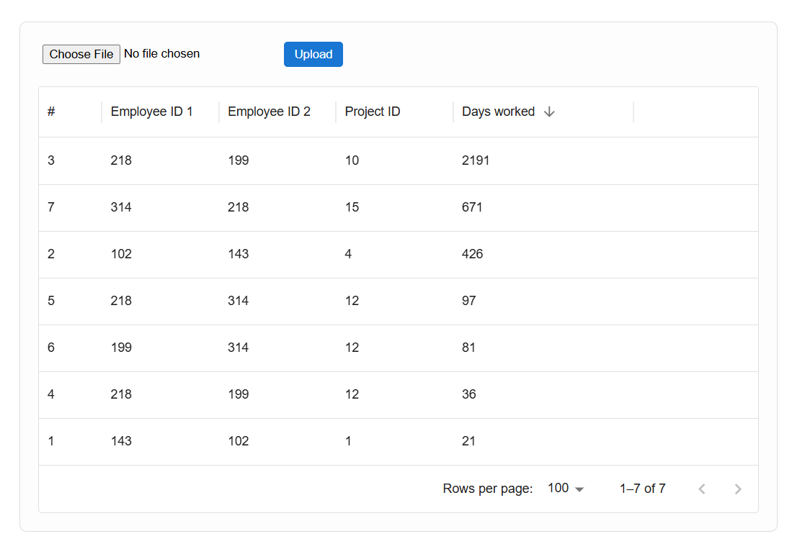

# Bogdan-Tropchev-employees
Create an application that identifies the pair of employees who have worked together on common projects for the longest period of time

node v20.19.4
npm 10.8.2

used csv example - employees.csv

How to run the app:
start the server:
- cd backend
- npm i
- node src/server.js OR nodemon src/server.js
- server will start on port 5000

start the react app:
- cd frontend
- npm i
- npm start
- app will start on port 3000

The server uses:
- express - to handle the server requests
- cors - to allow requests
- fs - to read the file
- formidable - to handle the submitted form
- csv-parser - work with the csv file
- date-fns - for easier formatting and dates normalization

The FE uses:
- react
- mui - for data grid styling
